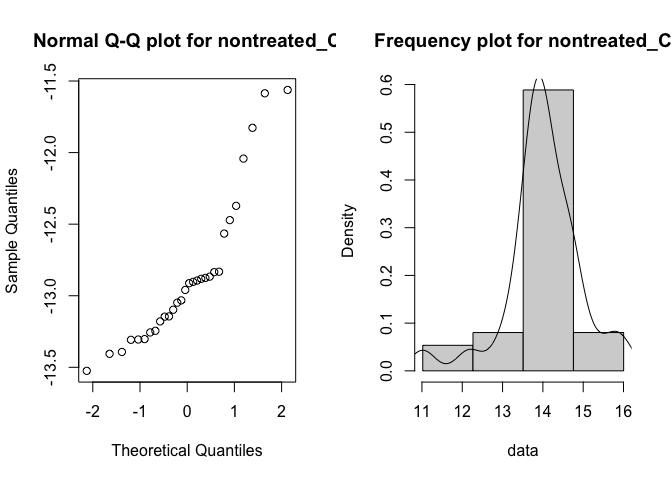
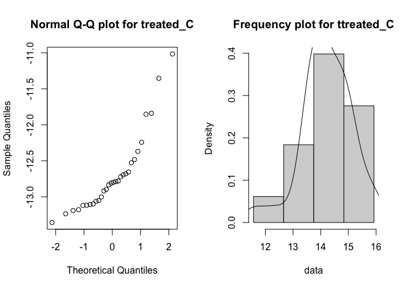
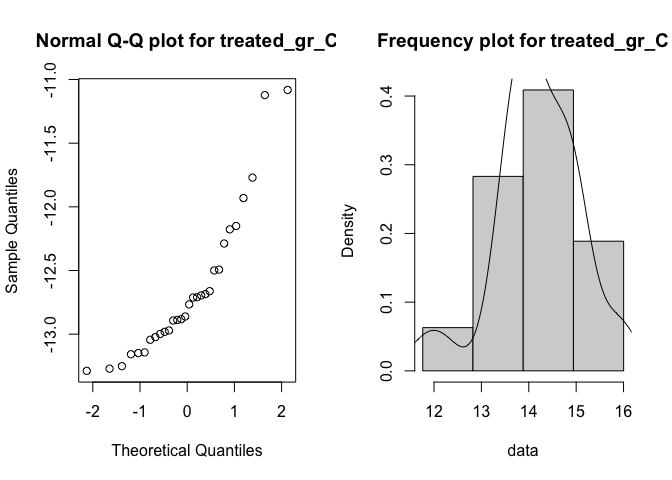
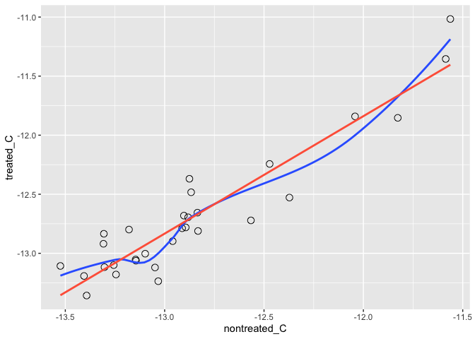

Sperm whale teeth, cut in half longitudinally, are used for determining their age from the dentine growth layers on the cut surface. In addition, if we take samples from different growth layers, we can analyze stable isotope values in each of them and see how they are changing through the animal's lifetime to determine changes in habitat and diet.

However, after simply cutting the tooth in half, the growth layer visibility is very poor because the surface is very smooth. To be able to determine age from the growth lines, scientists usually take one of the half-sections and treat it with formic acid to achieve a more pronounced surface relief. On top, they use a graphite pencil to cover the protruding parts of the surface with graphite, this way improving the growth layer visibility even more.

Usually, scientists used this treated half-section to determine the age and distinguish growth layers, but they used the non-treated half-section for sampling instead (because they thought treatment could affect the stable isotope values). However, when sampling from a half-section with poor growth layer visibility, obviously there are higher chances of error.

So what we want to do is investigate whether the treatments actually affect the stable isotope values in a way that does not allow the use of a treated half-section for sampling.

We want to see the difference between:

1. Non-treated samples VS Treated samples without graphite (clean)

2. Treated samples with graphite (not clean) VS Treated samples without graphite (clean)

This way we want to find out if:

a. We can only use the **non-treated** half-section for sampling

b. We can use the **treated half-section, but without the graphite layer** ( growth layer visibility better than a but worse than c)

c. We can use the **treated + graphite covered half-section** (ideal option, because the visibility is highest)

What was done in the lab:

1. I took 30 sperm whale teeth cut in half longitudinally. One half was not treated, the other half was treated and covered with graphite.

2. I sampled the dentine powder (using a drill) from the same (hopefully) growth layer in both half-sections of the teeth. This way I got 30 **non-treated** samples and 30 **treated+graphite** samples.

3. I then washed away the graphite from the treated+graphite half-section, and sampled it once again, getting 30 **treated samples without graphite**. 

4. I received the carbon (C) and nitrogen (N) stable isotope values in all of these samples after using a mass spectrometer. Time to analyze the results -> 


```r
library(dplyr)
```

```
## 
## Attaching package: 'dplyr'
```

```
## The following objects are masked from 'package:stats':
## 
##     filter, lag
```

```
## The following objects are masked from 'package:base':
## 
##     intersect, setdiff, setequal, union
```

```r
library(ggplot2)
library(lmtest)
```

```
## Loading required package: zoo
```

```
## 
## Attaching package: 'zoo'
```

```
## The following objects are masked from 'package:base':
## 
##     as.Date, as.Date.numeric
```

```r
library(car)
```

```
## Loading required package: carData
```

```
## 
## Attaching package: 'car'
```

```
## The following object is masked from 'package:dplyr':
## 
##     recode
```

```r
library(gridExtra)
```

```
## 
## Attaching package: 'gridExtra'
```

```
## The following object is masked from 'package:dplyr':
## 
##     combine
```


```r
teeth_data <- read.csv("Samples-Laura-CLEAN-FOR-R.csv")
names(teeth_data)[1] <- 'treated_gr_N'
names(teeth_data)[2] <- 'treated_gr_C'
```


## DATA EXPLORATION

### Data descripton and visualization via box plots

Let's explore the ranges for each variable in the sampled data

```r
summary(teeth_data)
```

```
##   treated_gr_N    treated_gr_C     nontreated_N    nontreated_C   
##  Min.   :11.76   Min.   :-13.29   Min.   :11.02   Min.   :-13.52  
##  1st Qu.:13.73   1st Qu.:-13.02   1st Qu.:13.67   1st Qu.:-13.23  
##  Median :14.15   Median :-12.81   Median :13.96   Median :-12.94  
##  Mean   :14.19   Mean   :-12.65   Mean   :14.01   Mean   :-12.86  
##  3rd Qu.:14.83   3rd Qu.:-12.49   3rd Qu.:14.58   3rd Qu.:-12.83  
##  Max.   :16.00   Max.   :-11.08   Max.   :16.00   Max.   :-11.56  
##    treated_N       treated_C     
##  Min.   :11.57   Min.   :-13.36  
##  1st Qu.:13.71   1st Qu.:-13.09  
##  Median :14.17   Median :-12.80  
##  Mean   :14.21   Mean   :-12.69  
##  3rd Qu.:14.91   3rd Qu.:-12.56  
##  Max.   :15.93   Max.   :-11.02
```
The summary seems to show different scales between the observation for the N vs C. The mean
for **treated_gr_N** is 14.15 with min/max values contained within the interval [11.76, 16.00]. However its counterpart **treated_gr_C** has a mean of -12.81 and the values are within [-13.29, -11.08]. A similar scenario occurs to **treated_N** vs **treated_C**. The following boxplot shows visually those scale differences.

```r
boxplot(teeth_data, las =2, main="Raw observations for N and C without scaling")
```

<!-- -->


Boxplots of all the variables (scaled, because N and C values differ a lot)

```r
boxplot(scale(teeth_data), las =2, main="Observations for N and C after scaling")
```

<!-- -->

### Observations follow a normal distribution?

This is not required for linear regression to be a valid model however we do it
for the sake of it.
#### Do the observations for Nitrogen follow a normal distribution?

Let's do Q-Q and frequency histograms

```r
draw_histogram_curve <- function(data, main_title) {
  
  bins <- ceiling(abs(max(data)) - min(data))
  hist(data, 
       breaks = seq(min(data), max(data), length.out = bins), 
       main=main_title, prob=TRUE)
  lines(density(data))
  
}

with(teeth_data, {
  par(mfrow = c(1, 2))
  qqnorm(nontreated_N, main="Normal Q-Q plot for nontreated_N")
  draw_histogram_curve(nontreated_N, "Frequency plot for nontreated_N")
  
  par(mfrow = c(1, 2))
  qqnorm(treated_N, main="Normal Q-Q plot for treated_N")
  draw_histogram_curve(treated_N, "Frequency plot for treated_N")
  
  par(mfrow = c(1, 2))
  qqnorm(treated_gr_N, main="Normal Q-Q plot for treated_gr_N")
  draw_histogram_curve(treated_gr_N, "Frequency plot for treated_gr_N")
  
 
  }) 
```

<!-- --><!-- --><!-- -->

#### Do the observations for Carbon follow a normal distribution?

Let's graph the Q-Q plots  and frequency distributions for all Carbon-like variables

```r
with(teeth_data, {
  par(mfrow = c(1, 2))
  qqnorm(nontreated_C, main="Normal Q-Q plot for nontreated_C")
  draw_histogram_curve(nontreated_N, "Frequency plot for nontreated_C")
  
  par(mfrow = c(1, 2))
  qqnorm(treated_C, main="Normal Q-Q plot for treated_C")
  draw_histogram_curve(treated_N, "Frequency plot for ttreated_C")
  
  par(mfrow = c(1, 2))
  qqnorm(treated_gr_C, main="Normal Q-Q plot for treated_gr_C")
  draw_histogram_curve(treated_gr_N, "Frequency plot for treated_gr_C")
  
 
  }) 
```

<!-- --><!-- --><!-- -->


It is difficult to conclude anything about the normality of both Carbon and Nitrogen observations. We will run *Shapiro-Will normality tests* where the null hypothesis is that the observations follows a normal distribution.

```r
normality = sapply(teeth_data, shapiro.test)
normality
```

```
##           treated_gr_N                  treated_gr_C                 
## statistic 0.9502305                     0.8505374                    
## p.value   0.1714801                     0.0006363171                 
## method    "Shapiro-Wilk normality test" "Shapiro-Wilk normality test"
## data.name "X[[i]]"                      "X[[i]]"                     
##           nontreated_N                  nontreated_C                 
## statistic 0.9169228                     0.8566444                    
## p.value   0.02233436                    0.0008568715                 
## method    "Shapiro-Wilk normality test" "Shapiro-Wilk normality test"
## data.name "X[[i]]"                      "X[[i]]"                     
##           treated_N                     treated_C                    
## statistic 0.9472398                     0.8398285                    
## p.value   0.1425366                     0.0003824903                 
## method    "Shapiro-Wilk normality test" "Shapiro-Wilk normality test"
## data.name "X[[i]]"                      "X[[i]]"
```

We can see that we cannot reject the null hypothesis for  **treated_gr_N and treated_N** as their p-values > 0.05, so this may suggest that they are indeed normally distributed. The value for **nontreated_N** and all for **Carbon** don't seem to follow a normal distribution, with the former very close to the rejection area.

### Matrix of graphs showing correlation
Again, this isn't fully required but it provides us with a landscape to visually confirm the correlation between observation sets of
the same element. 


```r
plot(teeth_data, main="Ploting every two pair of variables")
```

<!-- -->

We can see that all pair of variables of the same element seem to follow a positive tight correlation. We'll see this later on. For example, **treated_N** on cell [5,5] seems to be correlated to **treated_gr_N** on cell [1,5]. However, same cell [5,5] with **treated_gr_C** in cell [2,2] via cell [2,5] the shape of the relationship is weird - it doesn't follow a sort of straight line or a positive slope.

## Differences between samples

Now we want to know if the samples with different treatments differ significantly from each other.

### Testing for carbon isotope sample differences

1. Does the acid treatment have a visible effect on C isotope values? 
Let's boxplot the **non-treated samples** vs **treated samples**


```r
only_C_data <- teeth_data[,c(4,6,2)]
only_N_data <- teeth_data[,c(3,5,1)]
```


```r
boxplot(only_C_data, main="Carbon isotope values for the different treatments")
```

<!-- -->

We will use Wilconxon Signed-Rand (non-parametric) to test two non-independent samples that do not follow a normal distribution as it seems the case as shown earlier on. The null hyptothesis is that the average differences is zero so both samples are pretty similar. Therefore let's first compare non-treated sample C values with treated sample C values (without graphite) 


```r
wilcox.test(teeth_data$nontreated_C, teeth_data$treated_C, paired=TRUE)
```

```
## 
## 	Wilcoxon signed rank exact test
## 
## data:  teeth_data$nontreated_C and teeth_data$treated_C
## V = 52, p-value = 7.057e-05
## alternative hypothesis: true location shift is not equal to 0
```
The p-values is << 0.05 for this one, so **the acid treatment does alter C values significantly.**


2. Does graphite have a visible effect on carbon isotope values?
To see this we are comparing treated samples without a graphite layer vs treated samples with a graphite layer.


```r
wilcox.test(teeth_data$treated_C, teeth_data$treated_gr_C, paired=TRUE)
```

```
## 
## 	Wilcoxon signed rank exact test
## 
## data:  teeth_data$treated_C and teeth_data$treated_gr_C
## V = 166, p-value = 0.1772
## alternative hypothesis: true location shift is not equal to 0
```
The p-value > 0,05, this means that **graphite seems to not alter the C values significantly.**. We do not have grounds to think that both samples are significantlly different.


### Testing for nitrogen isotope sample differences

1. Does the acid treatment have a visible effect on N isotope values? 

```r
boxplot(only_N_data, main="Nitrogen isotope values for the different treatments")
```

<!-- -->
Similarly as for Carbon we run Wilcox test:


```r
wilcox.test(teeth_data$nontreated_N, teeth_data$treated_N, paired=TRUE)
```

```
## 
## 	Wilcoxon signed rank exact test
## 
## data:  teeth_data$nontreated_N and teeth_data$treated_N
## V = 70, p-value = 0.0004601
## alternative hypothesis: true location shift is not equal to 0
```
The p < 0,05 for this one too, so **the acid treatment does alter N values significantly** as well. 


2. Does graphite have a visible effect  N isotope values?


```r
wilcox.test(teeth_data$treated_N, teeth_data$treated_gr_N, paired=TRUE)
```

```
## 
## 	Wilcoxon signed rank exact test
## 
## data:  teeth_data$treated_N and teeth_data$treated_gr_N
## V = 264, p-value = 0.5291
## alternative hypothesis: true location shift is not equal to 0
```
Same as with C, the p-value > 0,05, this means that **graphite seems to not alter the N values significantly.** So at this point I think we can leave the graphite data behind as it became insignificant.


## Scatterplots 

Now we would like to find out if the differences between treated and non-treated samples are constant. If they are constant, we could use the treated half-sections after deriving a correction factor (a model) and applying it to determine the real values.

Maybe scatterplots could give us some idea?


```r
scatterplot(nontreated_C ~ treated_C, data=teeth_data,
   xlab="Treated sample C values", ylab="Non-treated sample C values",
   main="Scatterplot for C values")
```

<!-- -->


```r
scatterplot(nontreated_N ~ treated_N, data=teeth_data,
   xlab="Treated sample N values", ylab="Non-treated sample N values",
   main="Scatterplot for N values")
```

<!-- -->

# Fitting a a simple regression line

## How would a simple regression line fit for non_treated vs treated (both with and without graphite) for C?


```r
mC <- lm (treated_C ~ nontreated_C, teeth_data)
summary(mC)
```

```
## 
## Call:
## lm(formula = treated_C ~ nontreated_C, data = teeth_data)
## 
## Residuals:
##      Min       1Q   Median       3Q      Max 
## -0.37085 -0.10361  0.00083  0.07050  0.38753 
## 
## Coefficients:
##              Estimate Std. Error t value Pr(>|t|)    
## (Intercept)   0.09345    0.90793   0.103    0.919    
## nontreated_C  0.99436    0.07055  14.095 3.06e-14 ***
## ---
## Signif. codes:  0 '***' 0.001 '**' 0.01 '*' 0.05 '.' 0.1 ' ' 1
## 
## Residual standard error: 0.1976 on 28 degrees of freedom
## Multiple R-squared:  0.8765,	Adjusted R-squared:  0.8721 
## F-statistic: 198.7 on 1 and 28 DF,  p-value: 3.063e-14
```

```r
mgC <- lm (treated_gr_C ~ nontreated_C, teeth_data)
summary(mgC)
```

```
## 
## Call:
## lm(formula = treated_gr_C ~ nontreated_C, data = teeth_data)
## 
## Residuals:
##      Min       1Q   Median       3Q      Max 
## -0.42374 -0.09110 -0.02797  0.13650  0.49126 
## 
## Coefficients:
##              Estimate Std. Error t value Pr(>|t|)    
## (Intercept)   0.43338    1.01961   0.425    0.674    
## nontreated_C  1.01755    0.07923  12.843 2.95e-13 ***
## ---
## Signif. codes:  0 '***' 0.001 '**' 0.01 '*' 0.05 '.' 0.1 ' ' 1
## 
## Residual standard error: 0.222 on 28 degrees of freedom
## Multiple R-squared:  0.8549,	Adjusted R-squared:  0.8497 
## F-statistic:   165 on 1 and 28 DF,  p-value: 2.951e-13
```

In both cases it occurs the following:

1. slope coefficient are very significant
2. The intercept is within the non-rejection area with p-value < 0.05.
3. R Square are pretty good

So it seems that the linear regression is a pretty good estimator. It would be interesting to see if the residuals are normally distributed.


```r
resid_values_mc <- residuals(mC)
resid_values_mgc <- residuals(mgC)
par(mfrow = c(2, 2))
hist(resid_values_mc, main="")
boxplot(resid_values_mc)
mtext("Histogram and boxplot for non-graphite lm's residuals", side = 3, line = -1, outer = TRUE)
mtext("Histogram and boxplot for graphite lm's residuals", side = 3, line = -15, outer = TRUE)
hist(resid_values_mgc, main="")
boxplot(resid_values_mgc)
```

<!-- -->


```r
plot(resid_values_mc, main="Squareness of non-graphite residuals")
```

<!-- -->

```r
plot(resid_values_mgc, main ="Squareness of graphite residuals")
```

<!-- -->

```r
shapiro.test(resid_values_mc)
```

```
## 
## 	Shapiro-Wilk normality test
## 
## data:  resid_values_mc
## W = 0.97281, p-value = 0.6185
```

```r
shapiro.test(resid_values_mgc)
```

```
## 
## 	Shapiro-Wilk normality test
## 
## data:  resid_values_mgc
## W = 0.97932, p-value = 0.8071
```
Non of the two residuals seems to be normally distributed although the treated with folic acid approaches close to significant. 


## How would a simple regression line fit for non_treated vs treated (both with and without graphite) for N?


```r
mN <- lm (treated_N ~ nontreated_N, teeth_data)
summary(mN)
```

```
## 
## Call:
## lm(formula = treated_N ~ nontreated_N, data = teeth_data)
## 
## Residuals:
##      Min       1Q   Median       3Q      Max 
## -0.69013 -0.14174  0.05581  0.13388  0.72028 
## 
## Coefficients:
##              Estimate Std. Error t value Pr(>|t|)    
## (Intercept)   1.38802    0.77034   1.802   0.0824 .  
## nontreated_N  0.91561    0.05488  16.685 4.43e-16 ***
## ---
## Signif. codes:  0 '***' 0.001 '**' 0.01 '*' 0.05 '.' 0.1 ' ' 1
## 
## Residual standard error: 0.2785 on 28 degrees of freedom
## Multiple R-squared:  0.9086,	Adjusted R-squared:  0.9053 
## F-statistic: 278.4 on 1 and 28 DF,  p-value: 4.43e-16
```


```r
mgN <- lm (treated_gr_N ~ nontreated_N, teeth_data)
summary(mgN)
```

```
## 
## Call:
## lm(formula = treated_gr_N ~ nontreated_N, data = teeth_data)
## 
## Residuals:
##      Min       1Q   Median       3Q      Max 
## -0.49606 -0.10626  0.03736  0.10739  0.46525 
## 
## Coefficients:
##              Estimate Std. Error t value Pr(>|t|)    
## (Intercept)   1.30609    0.59763   2.185   0.0374 *  
## nontreated_N  0.91962    0.04257  21.601   <2e-16 ***
## ---
## Signif. codes:  0 '***' 0.001 '**' 0.01 '*' 0.05 '.' 0.1 ' ' 1
## 
## Residual standard error: 0.216 on 28 degrees of freedom
## Multiple R-squared:  0.9434,	Adjusted R-squared:  0.9414 
## F-statistic: 466.6 on 1 and 28 DF,  p-value: < 2.2e-16
```
In both cases it occurs the following:

1. slope coefficient are very significant
2. The intercept is quasi-significant for treated_N and significant for treated_gr_N
3. R Square are pretty good

So it seems that the linear regression is a pretty good estimator. It would be interesting to see if the residuals are normally distributed.


```r
resid_values_mn <- residuals(mN)
resid_values_mgn <- residuals(mgN)
par(mfrow = c(2, 2))
hist(resid_values_mn, main="")
boxplot(resid_values_mn)
mtext("Histogram and boxplot for non-graphite residuals", side = 3, line = -1, outer = TRUE)
mtext("Histogram and boxplot for graphite residuals", side = 3, line = -15, outer = TRUE)
hist(resid_values_mgn, main="")
boxplot(resid_values_mgn)
```

<!-- -->

```r
plot(resid_values_mn, main="Squareness of non-graphite residuals")
```

<!-- -->

```r
plot(resid_values_mgn, main="Squareness of graphite residuals")
```

<!-- -->


```r
shapiro.test(resid_values_mn)
```

```
## 
## 	Shapiro-Wilk normality test
## 
## data:  resid_values_mn
## W = 0.95445, p-value = 0.2221
```

```r
shapiro.test(resid_values_mgn)
```

```
## 
## 	Shapiro-Wilk normality test
## 
## data:  resid_values_mgn
## W = 0.97628, p-value = 0.7203
```

As for Carbon non of the residuals seem to be normally distributed

## Heteroscedasticity test
We would expect that if residuals in both samples (C and N) aren't normally distributed, the heteroscedasticity would also fail but not very far off as the p-values
of the hypothesis tests used for normality were that too far away from the rejection area.


```r
bptest(mN)
```

```
## 
## 	studentized Breusch-Pagan test
## 
## data:  mN
## BP = 0.079953, df = 1, p-value = 0.7774
```

```r
bptest(mC)
```

```
## 
## 	studentized Breusch-Pagan test
## 
## data:  mC
## BP = 1.3178, df = 1, p-value = 0.251
```
Both tests show that heteroscedasticity is not singificant.


## Best fitted line vs Linear regression

### Carbon


```r
ggplot(teeth_data, aes(nontreated_C, treated_C)) +
  geom_point(shape = 21, size = 3) + 
  geom_smooth(se = FALSE) +
  geom_smooth(method = lm, col = "tomato", se = FALSE)
```

```
## `geom_smooth()` using method = 'loess' and formula 'y ~ x'
```

```
## `geom_smooth()` using formula 'y ~ x'
```

<!-- -->
### Nitrogen


```r
ggplot(teeth_data, aes(nontreated_N, treated_N)) +
  geom_point(shape = 21, size = 3) + 
  geom_smooth(se = FALSE) +
  geom_smooth(method = lm, col = "tomato", se = FALSE)
```

```
## `geom_smooth()` using method = 'loess' and formula 'y ~ x'
```

```
## `geom_smooth()` using formula 'y ~ x'
```

<!-- -->
