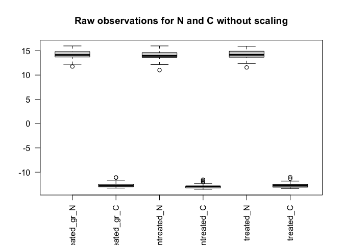
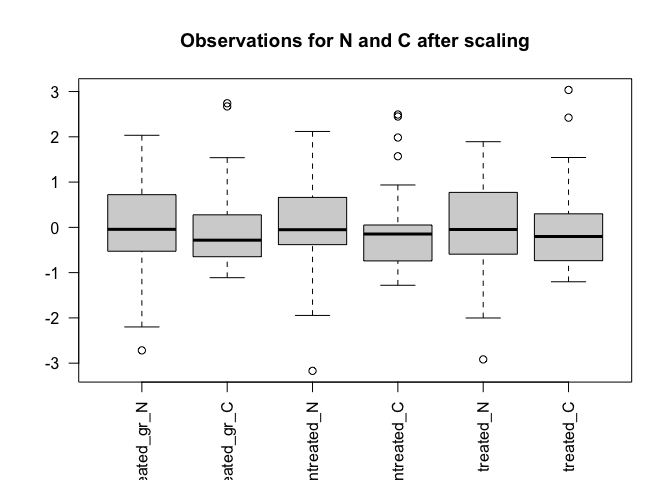
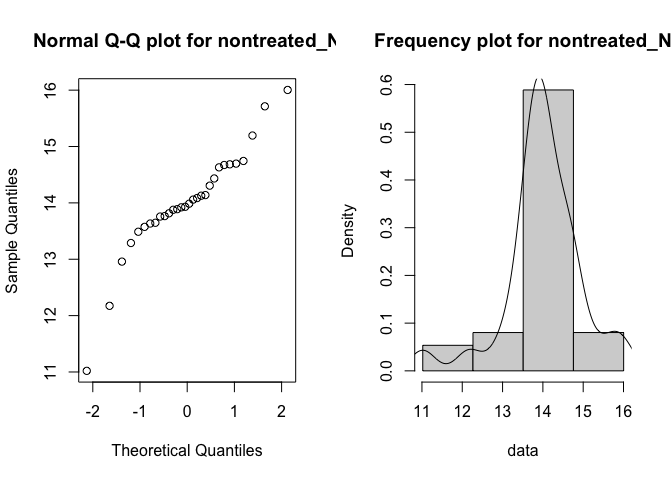
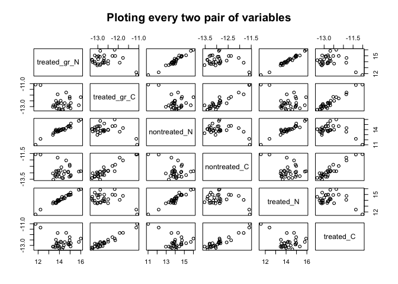
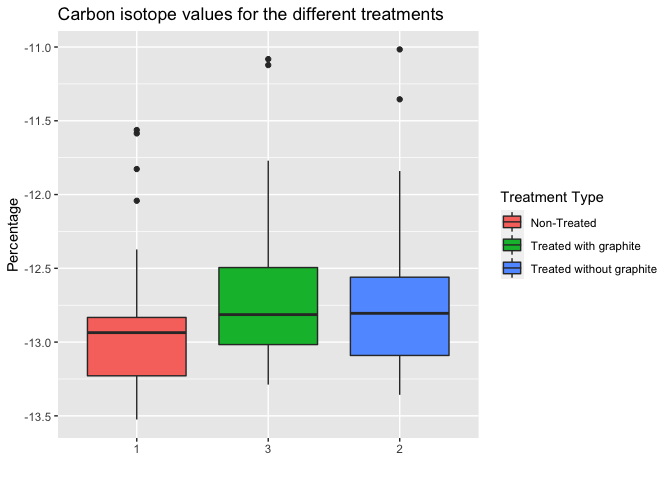
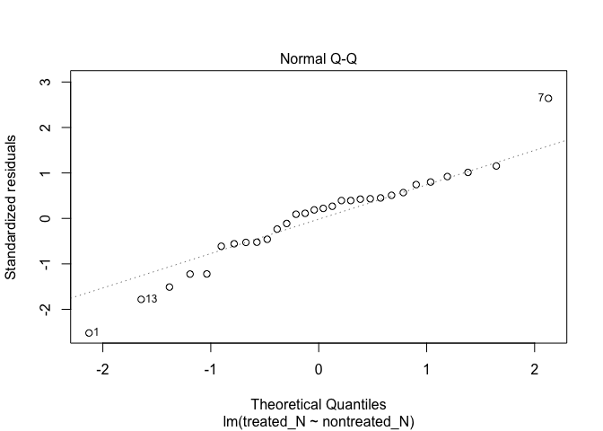
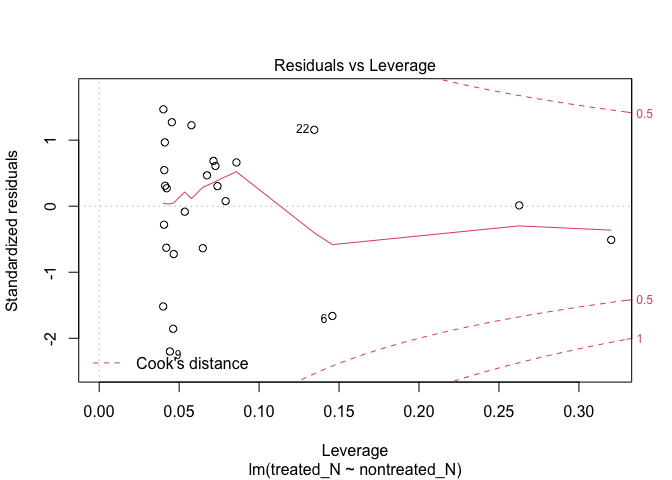
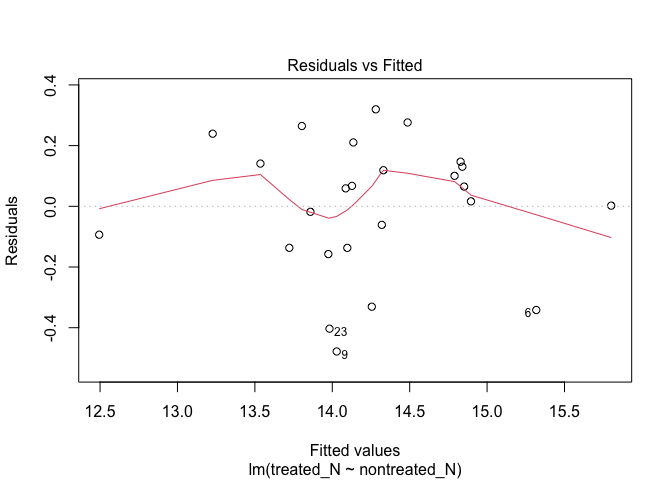

Sperm whale teeth, cut in half longitudinally, are used for determining their age from the dentine growth layers on the cut surface. In addition, if we take samples from different growth layers, we can analyze stable isotope values in each of them and see how they are changing through the animal's lifetime to determine changes in habitat and diet.

However, after simply cutting the tooth in half, the growth layer visibility is very poor because the surface is very smooth. To be able to determine age from the growth lines, scientists usually take one of the half-sections and treat it with formic acid to achieve a more pronounced surface relief. On top, they use a graphite pencil to cover the protruding parts of the surface with graphite, this way improving the growth layer visibility even more.

Usually, scientists used this treated half-section to determine the age and distinguish growth layers, but they used the non-treated half-section for sampling instead (because they thought treatment could affect the stable isotope values). However, when sampling from a half-section with poor growth layer visibility, obviously there are higher chances of error.

So what we want to do is investigate whether the treatments actually affect the stable isotope values in a way that does not allow the use of a treated half-section for sampling.

We want to see the difference between:

1. Non-treated samples VS Treated samples without graphite (clean)

2. Treated samples with graphite (not clean) VS Treated samples without graphite (clean)

This way we want to find out if:

a. We can only use the **non-treated** half-section for sampling

b. We can use the **treated half-section, but without the graphite layer** ( growth layer visibility better than a but worse than c)

c. We can use the **treated + graphite covered half-section** (ideal option, because the visibility is highest)

What was done in the lab:

1. I took 30 sperm whale teeth cut in half longitudinally. One half was not treated, the other half was treated and covered with graphite.

2. I sampled the dentine powder (using a drill) from the same (hopefully) growth layer in both half-sections of the teeth. This way I got 30 **non-treated** samples and 30 **treated+graphite** samples.

3. I then washed away the graphite from the treated+graphite half-section, and sampled it once again, getting 30 **treated samples without graphite**. 

4. I received the carbon (C) and nitrogen (N) stable isotope values in all of these samples after using a mass spectrometer. Time to analyze the results -> 


```r
library(dplyr)
```

```
## 
## Attaching package: 'dplyr'
```

```
## The following objects are masked from 'package:stats':
## 
##     filter, lag
```

```
## The following objects are masked from 'package:base':
## 
##     intersect, setdiff, setequal, union
```

```r
library(ggplot2)
library(lmtest)
```

```
## Loading required package: zoo
```

```
## 
## Attaching package: 'zoo'
```

```
## The following objects are masked from 'package:base':
## 
##     as.Date, as.Date.numeric
```

```r
library(car)
```

```
## Loading required package: carData
```

```
## 
## Attaching package: 'car'
```

```
## The following object is masked from 'package:dplyr':
## 
##     recode
```

```r
library(gridExtra)
```

```
## 
## Attaching package: 'gridExtra'
```

```
## The following object is masked from 'package:dplyr':
## 
##     combine
```


```r
teeth_data <- read.csv("Samples-Laura-CLEAN-FOR-R.csv")
names(teeth_data)[1] <- 'treated_gr_N'
names(teeth_data)[2] <- 'treated_gr_C'
```


## DATA EXPLORATION

### Data descripton and visualization via box plots

Let's explore the ranges for each variable in the sampled data

```r
summary(teeth_data)
```

```
##   treated_gr_N    treated_gr_C     nontreated_N    nontreated_C   
##  Min.   :11.76   Min.   :-13.29   Min.   :11.02   Min.   :-13.52  
##  1st Qu.:13.73   1st Qu.:-13.02   1st Qu.:13.67   1st Qu.:-13.23  
##  Median :14.15   Median :-12.81   Median :13.96   Median :-12.94  
##  Mean   :14.19   Mean   :-12.65   Mean   :14.01   Mean   :-12.86  
##  3rd Qu.:14.83   3rd Qu.:-12.49   3rd Qu.:14.58   3rd Qu.:-12.83  
##  Max.   :16.00   Max.   :-11.08   Max.   :16.00   Max.   :-11.56  
##    treated_N       treated_C     
##  Min.   :11.57   Min.   :-13.36  
##  1st Qu.:13.71   1st Qu.:-13.09  
##  Median :14.17   Median :-12.80  
##  Mean   :14.21   Mean   :-12.69  
##  3rd Qu.:14.91   3rd Qu.:-12.56  
##  Max.   :15.93   Max.   :-11.02
```
The summary seems to show different scales between the observation for the N vs C. The mean
for **treated_gr_N** is 14.15 with min/max values contained within the interval [11.76, 16.00]. However its counterpart **treated_gr_C** has a mean of -12.81 and the values are within [-13.29, -11.08]. A similar scenario occurs to **treated_N** vs **treated_C**. The following boxplot shows visually those scale differences.

```r
boxplot(teeth_data, las =2, main="Raw observations for N and C without scaling")
```

<!-- -->


Boxplots of all the variables (scaled, because N and C values differ a lot)

```r
boxplot(scale(teeth_data), las =2, main="Observations for N and C after scaling")
```

<!-- -->

### Observations follow a normal distribution?

This is not required for linear regression to be a valid model however we do it
for the sake of it.
#### Do the observations for Nitrogen follow a normal distribution?

We do not need to check whether the dependent and independent variables follow a normalLet's graph the Q-Q plots for all Nitrogen-like variables

```r
par(mfrow = c(3, 1))
with(teeth_data, { 
  qqnorm(nontreated_N, main="Normal Q-Q plot for nontreated_N")
  qqnorm(treated_N, main="Normal Q-Q plot for treated_N")
  qqnorm(treated_gr_N, main="Normal Q-Q plot for treated_gr_N")
  }) 
```

<!-- -->

#### Do the observations for Carbon follow a normal distribution?

Let's graph the Q-Q plots for all Carbon-like variables

```r
par(mfrow = c(3, 1))
with(teeth_data, { 
  qqnorm(nontreated_C, main="Normal Q-Q plot for nontreated_C")
  qqnorm(treated_C, main="Normal Q-Q plot for treated_C")
  qqnorm(treated_gr_C, main="Normal Q-Q plot for treated_gr_C")
  }) 
```

<!-- -->


It is difficult to conclude anything about the normality of both Carbon and Nitrogen observations. We will run *Shapiro-Will normality tests* where the null hypothesis is that the observations follows a normal distribution.

```r
normality = sapply(teeth_data, shapiro.test)
normality
```

```
##           treated_gr_N                  treated_gr_C                 
## statistic 0.9502305                     0.8505374                    
## p.value   0.1714801                     0.0006363171                 
## method    "Shapiro-Wilk normality test" "Shapiro-Wilk normality test"
## data.name "X[[i]]"                      "X[[i]]"                     
##           nontreated_N                  nontreated_C                 
## statistic 0.9169228                     0.8566444                    
## p.value   0.02233436                    0.0008568715                 
## method    "Shapiro-Wilk normality test" "Shapiro-Wilk normality test"
## data.name "X[[i]]"                      "X[[i]]"                     
##           treated_N                     treated_C                    
## statistic 0.9472398                     0.8398285                    
## p.value   0.1425366                     0.0003824903                 
## method    "Shapiro-Wilk normality test" "Shapiro-Wilk normality test"
## data.name "X[[i]]"                      "X[[i]]"
```

We can see that we cannot reject the null hypothesis for  **treated_gr_N and treated_N** as their p-values > 0.5, so this may suggest that they are indeed normally distributed. The value for **nontreated_N** and all for **Carbon** don't seem to follow a normal distribution, with the former very close to the rejection area.

### Matrix of graphs showing correlation
Again, this isn't fully required but it provides us with a landscape to visually confirm the correlation between observation sets of
the same element. 


```r
plot(teeth_data, main="Ploting every two pair of variables")
```

<!-- -->

We can see that all pair of variables of the same element seem to follow a positive tight correlation. We'll see this later on. For example, **treated_N** on cell [5,5] seems to be correlated to **treated_gr_N** on cell [1,5]. However, same cell [5,5] with **treated_gr_C** in cell [2,2] via cell [2,5] the shape of the relationship is weird - it doesn't follow a sort of straight line and a positive slope.

## Differences between samples

Now we want to know if the samples with different treatments differ significantly from each other.
I thought to use the Paired Samples Wilcoxon signed rank test (non-parametric) for all of them - not sure if this is the best decision but I guess it should serve us.


1. Does the acid treatment have a visible effect on C and N isotope values? 
To answer this, we are comparing **non-treated samples** (boxplot 1) with **treated samples (without graphite)** (boxplot 2).


```r
only_C_data <- teeth_data[,c(4,6,2)]
only_N_data <- teeth_data[,c(3,5,1)]
```


```r
boxplot(only_C_data)
```

<!-- -->

Let's compare non-treated sample C values with treated sample C values (without graphite) using a Paired Samples Wilcoxon Signed-rank test (non-parametric)


```r
wilcox.test(teeth_data$nontreated_C, teeth_data$treated_C, paired=TRUE)
```

```
## 
## 	Wilcoxon signed rank exact test
## 
## data:  teeth_data$nontreated_C and teeth_data$treated_C
## V = 52, p-value = 7.057e-05
## alternative hypothesis: true location shift is not equal to 0
```
The p is less than 0,05 for this one, so **the acid treatment does alter C values significantly.**

What about N?


```r
boxplot(only_N_data)
```

<!-- -->

```r
wilcox.test(teeth_data$nontreated_N, teeth_data$treated_N, paired=TRUE)
```

```
## 
## 	Wilcoxon signed rank exact test
## 
## data:  teeth_data$nontreated_N and teeth_data$treated_N
## V = 70, p-value = 0.0004601
## alternative hypothesis: true location shift is not equal to 0
```
The p is less than 0,05 for this one too, so **the acid treatment does alter N values significantly** as well.


2. Does graphite have a visible effect on C and N isotope values?

<span style="color:blue">is this step necessary? If I did not misunderstand the process the acid treatment and graphite are sequential phases
with the former being run ahead of the latter. In such case and given that our earlier wilcox test altered the C and N values already, the test
on graphite would then be irrelevant? </span>.

To see this we are comparing treated samples without a graphite layer vs treated samples with a graphite layer.

First for C:


```r
wilcox.test(teeth_data$treated_C, teeth_data$treated_gr_C, paired=TRUE)
```

```
## 
## 	Wilcoxon signed rank exact test
## 
## data:  teeth_data$treated_C and teeth_data$treated_gr_C
## V = 166, p-value = 0.1772
## alternative hypothesis: true location shift is not equal to 0
```
The p value is larger than 0,05, this means that **graphite seems to not alter the C values significantly.** (this would mean if we were to use the treated half-section of the tooth in the future, cleaning off the graphite is unnecesarry. We could leave it there and have better visibility of growth layers this way.) 

What about N?


```r
wilcox.test(teeth_data$treated_N, teeth_data$treated_gr_N, paired=TRUE)
```

```
## 
## 	Wilcoxon signed rank exact test
## 
## data:  teeth_data$treated_N and teeth_data$treated_gr_N
## V = 264, p-value = 0.5291
## alternative hypothesis: true location shift is not equal to 0
```
Same as with C, the p value is larger than 0,05, this means that **graphite seems to not alter the N values significantly.** So at this point I think we can leave the graphite data behind as it became insignificant.


## Scatterplots 

Now we would like to find out if the differences between treated and non-treated samples are constant. If they are constant, we could use the treated half-sections after deriving a correction factor (a model) and applying it to determine the real values.

Maybe scatterplots could give us some idea?


```r
scatterplot(nontreated_C ~ treated_C, data=teeth_data,
   xlab="Treated sample C values", ylab="Non-treated sample C values",
   main="Scatterplot for C values")
```

<!-- -->


```r
scatterplot(nontreated_N ~ treated_N, data=teeth_data,
   xlab="Treated sample N values", ylab="Non-treated sample N values",
   main="Scatterplot for N values")
```

<!-- -->
## Dispersion of differences


Maybe we should take a look at how dispersed are the differences for these values. For this we could create new variables by subtracting one variable from another (values before treatment - values after treatment):


```r
teeth_data$difC <- teeth_data$nontreated_C - teeth_data$treated_C
teeth_data$difN <- teeth_data$nontreated_N - teeth_data$treated_N
```


```r
C_difference <- teeth_data[,c(7)]
N_difference <- teeth_data[,c(8)]
```


```r
sd(C_difference)
```

```
## [1] 0.194227
```

```r
sd(N_difference)
```

```
## [1] 0.284966
```

```r
summary(C_difference)
```

```
##    Min. 1st Qu.  Median    Mean 3rd Qu.    Max. 
## -0.5462 -0.2305 -0.1678 -0.1659 -0.0633  0.2039
```

```r
summary(N_difference)
```

```
##     Min.  1st Qu.   Median     Mean  3rd Qu.     Max. 
## -0.89027 -0.37738 -0.24373 -0.20597 -0.07623  0.48236
```


```r
boxplot(C_difference)
```

<!-- -->


```r
boxplot(N_difference)
```

<!-- -->

#DOUBT 
*Not sure if I should remove all these outliers... Looks like the differences are pretty varied?*
I also tested the distribution of these differences for normality and both do follow a normal distribution.


# Trying out a model

Just out of curiosity, I am trying to apply a linear regression model to this data.


```r
mC <- lm (treated_C ~ nontreated_C, teeth_data)
summary(mC)
```

```
## 
## Call:
## lm(formula = treated_C ~ nontreated_C, data = teeth_data)
## 
## Residuals:
##      Min       1Q   Median       3Q      Max 
## -0.37085 -0.10361  0.00083  0.07050  0.38753 
## 
## Coefficients:
##              Estimate Std. Error t value Pr(>|t|)    
## (Intercept)   0.09345    0.90793   0.103    0.919    
## nontreated_C  0.99436    0.07055  14.095 3.06e-14 ***
## ---
## Signif. codes:  0 '***' 0.001 '**' 0.01 '*' 0.05 '.' 0.1 ' ' 1
## 
## Residual standard error: 0.1976 on 28 degrees of freedom
## Multiple R-squared:  0.8765,	Adjusted R-squared:  0.8721 
## F-statistic: 198.7 on 1 and 28 DF,  p-value: 3.063e-14
```

```r
plot(mC)
```

<!-- --><!-- --><!-- --><!-- -->

In the first plot it looks like the residuals are pretty dispersed... Not good?
<span style="color:blue">Quite the contrary. It is actually a very good one as most points can be squared in a rectangle which longer sides run parallel to the x-axis</span>.

Trying N now:

<span style="color:blue">Look at the p-value! It is amazingly significant. It is 0.000000000000000443, this is a pretty strong indication that the
linear regression model is a good fit. In addition look at the Rsquare which explains how much the variance is explained by our model, that is to say, SSE/SSR. This is saying that 90% of the variance is explained by the model itself. In other words, our regression model is capable of explaining most
of the observations with a marginal error. Good for you!</span>


```r
mN <- lm (treated_N ~ nontreated_N, teeth_data)
summary(mN)
```

```
## 
## Call:
## lm(formula = treated_N ~ nontreated_N, data = teeth_data)
## 
## Residuals:
##      Min       1Q   Median       3Q      Max 
## -0.69013 -0.14174  0.05581  0.13388  0.72028 
## 
## Coefficients:
##              Estimate Std. Error t value Pr(>|t|)    
## (Intercept)   1.38802    0.77034   1.802   0.0824 .  
## nontreated_N  0.91561    0.05488  16.685 4.43e-16 ***
## ---
## Signif. codes:  0 '***' 0.001 '**' 0.01 '*' 0.05 '.' 0.1 ' ' 1
## 
## Residual standard error: 0.2785 on 28 degrees of freedom
## Multiple R-squared:  0.9086,	Adjusted R-squared:  0.9053 
## F-statistic: 278.4 on 1 and 28 DF,  p-value: 4.43e-16
```

```r
plot(mN)
```

<!-- --><!-- --><!-- --><!-- -->
In the first graph some residuals are dispersed too... Not good again? I wonder if it would be better if we removed the outliers that are seen in the boxplots of differences.

## Removing outliers

I will try to remove some outliers to see if the situation gets better. 
<span style="color:blue">If you look at the new p-value without the outliers, its value has been decreased. Looking at it in terms of visual representation, with the "outliers" gone the shape lost its "squareness" hence the p-value is worse than the original test.</span>


```r
teeth_sin_outliers <- teeth_data %>% slice(-c(7, 1, 17, 5, 12))
```


```r
mCsin <- lm (treated_C ~ nontreated_C, teeth_sin_outliers)
summary(mCsin)
```

```
## 
## Call:
## lm(formula = treated_C ~ nontreated_C, data = teeth_sin_outliers)
## 
## Residuals:
##      Min       1Q   Median       3Q      Max 
## -0.26595 -0.08844 -0.02197  0.12771  0.28476 
## 
## Coefficients:
##              Estimate Std. Error t value Pr(>|t|)    
## (Intercept)  -1.18361    0.83434  -1.419    0.169    
## nontreated_C  0.89702    0.06469  13.865 1.17e-12 ***
## ---
## Signif. codes:  0 '***' 0.001 '**' 0.01 '*' 0.05 '.' 0.1 ' ' 1
## 
## Residual standard error: 0.1579 on 23 degrees of freedom
## Multiple R-squared:  0.8931,	Adjusted R-squared:  0.8885 
## F-statistic: 192.2 on 1 and 23 DF,  p-value: 1.175e-12
```

```r
plot(mCsin)
```

<!-- --><!-- --><!-- --><!-- -->

Umm.. Is this considered better?


```r
mNsin <- lm (treated_N ~ nontreated_N, teeth_sin_outliers)
summary(mNsin)
```

```
## 
## Call:
## lm(formula = treated_N ~ nontreated_N, data = teeth_sin_outliers)
## 
## Residuals:
##      Min       1Q   Median       3Q      Max 
## -0.47831 -0.13675  0.05912  0.14083  0.31957 
## 
## Coefficients:
##              Estimate Std. Error t value Pr(>|t|)    
## (Intercept)   1.12029    0.88471   1.266    0.218    
## nontreated_N  0.93434    0.06291  14.851 2.82e-13 ***
## ---
## Signif. codes:  0 '***' 0.001 '**' 0.01 '*' 0.05 '.' 0.1 ' ' 1
## 
## Residual standard error: 0.2224 on 23 degrees of freedom
## Multiple R-squared:  0.9056,	Adjusted R-squared:  0.9015 
## F-statistic: 220.6 on 1 and 23 DF,  p-value: 2.818e-13
```

```r
plot(mNsin)
```

<!-- --><!-- --><!-- --><!-- -->
Not sure if this way the model got better really...


## Heteroscedasticity test

<span style="color:blue">Yeah, the null hypothesis here is that there is no Heteroscedasticity but the the p-values are saying that we should
reject it. However I am not sure about this test being crucial for the overall conclusions.</span>.

Here I tried some test I found for heteroscedasticity (Breusch-Pagan test). Not sure if it fits well here, but...


```r
bptest(mN)
```

```
## 
## 	studentized Breusch-Pagan test
## 
## data:  mN
## BP = 0.079953, df = 1, p-value = 0.7774
```

```r
bptest(mC)
```

```
## 
## 	studentized Breusch-Pagan test
## 
## data:  mC
## BP = 1.3178, df = 1, p-value = 0.251
```
The test rejects the hypothesis of heteroscedasticity, so can we then say the variance in differences is low and the model is actually good?


## Just some additional ggplots


```r
ggplot(teeth_data, aes(nontreated_C, treated_C)) +
  geom_point(shape = 21, size = 3) + 
  geom_smooth(se = FALSE) +
  geom_smooth(method = lm, col = "tomato", se = FALSE)
```

```
## `geom_smooth()` using method = 'loess' and formula 'y ~ x'
```

```
## `geom_smooth()` using formula 'y ~ x'
```

<!-- -->

```r
ggplot(teeth_data, aes(nontreated_N, treated_N)) +
  geom_point(shape = 21, size = 3) + 
  geom_smooth(se = FALSE) +
  geom_smooth(method = lm, col = "tomato", se = FALSE)
```

```
## `geom_smooth()` using method = 'loess' and formula 'y ~ x'
```

```
## `geom_smooth()` using formula 'y ~ x'
```

<!-- -->


## Conclusions


I think we are done with linear regression. It is pretty clear that there is a relationship.


## Improvements

1. Contextualise the plots by adding meaningful titles and adding axis names for those that have them missing
2. Perhaps doing a one-way Anova in order to determine that the graphite dust doesn't alter the linear relationship between non-treated vs treated. Given
that Anova looks at explaining the linear relationship between variables with the less complexity possible, I would expect that the non-treated vs treated-acid-only would be enough. In other words, that Anova will tell us to get rid of the graphite phase because it does not add any real substantial
value, only complexity. Reading it from another angle, that would mean that we can correlate safely non-treated vs treated-with-acid-and-graphite. That
would also be backed up by the fact that when we checked whether graphite altered the values of C and N, the test result was that it didn't. It is a 
transitive relationship if A -> B and B -> C --> A --> C. In our case would be if Non-Treated vs Treated-Acid_only has a relationship and Treated-Acid-Only
vs Treated-Acid-Graphite changes nothing then Non-Treated vs Treated-Acid-Graphite do have too a linear relationship. Anova would tell us exactly that I believe?

I could give it a go to Anova myself if you like - primarily I would just ensure that we aren't overengineering it.


